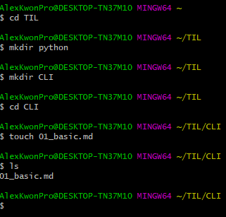

# Basic CLI

## 폴더(directory) 관련

폴더 상징 특수기호들

* `~`
  * Home Directory 를 의미 (홈폴더)
  * 위치는 일반적으로 /C/Users/계정명
* `/`
  * Root 폴더(최상단)를 의미
* `.`
* `..`

## 명령어

* cd [대상폴더] : 
* ls
* rm
* mkdir
* touch

```
$ mkdir TIL
$ cd TIL
$ mkdir CLI
$ cd CLI
$ touch 01_basic.md
```

```python
def new_func(args):
	print('hi')
```

```javascript
function hello(args) {
    
}
```



## SUMMARY

| 명령어 | 설명          | 상세                 |
| ------ | ------------- | -------------------- |
| `ls`   | 목록 보여주기 | `ls -a`전체 보여주기 |
|        |               |                      |
|        |               |                      |

